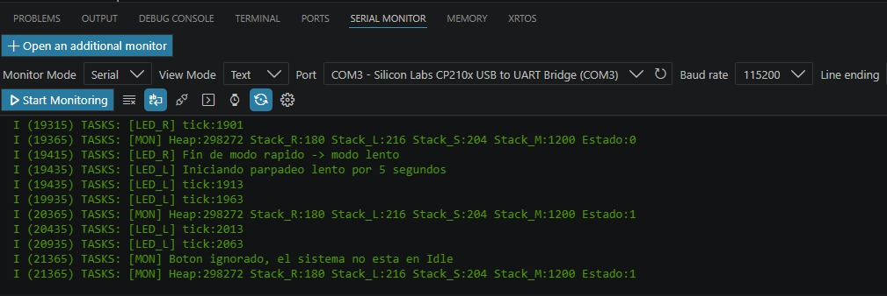
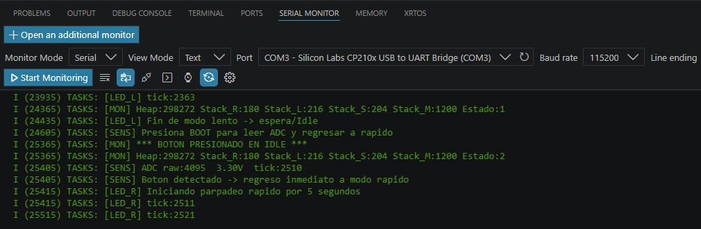
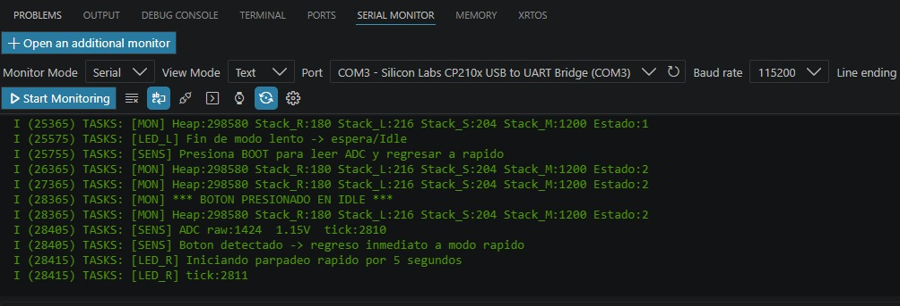
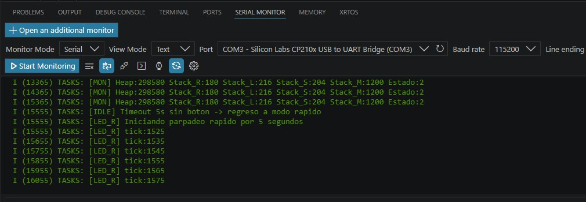

Práctica 1 - Tareas, prioridades, Idle Task y ciclo LED/Sensor
Integrantes
Juliana Aseret Estrada Flores — 8572
Ana Gloria Vázquez Cristobal — 10075

Descripción de la práctica

La práctica consiste en implementar un sistema multitarea utilizando FreeRTOS sobre una tarjeta ESP32 mediante ESP-IDF y PlatformIO.

El sistema realiza un ciclo automático donde el LED parpadea en modo rápido durante 5 segundos, después cambia a modo lento durante 5 segundos y posteriormente entra a un estado de espera. Durante esta etapa de espera, si se presiona el botón BOOT, el sistema realiza una lectura del ADC del potenciómetro, muestra el valor y el voltaje por UART, y regresa inmediatamente al modo rápido. Si no se presiona el botón, el sistema espera 5 segundos y vuelve automáticamente al modo rápido.

Funcionamiento

El sistema multitarea gestiona:

1. Parpadeo rápido del LED cada 100 ms durante 5 segundos.
2. Parpadeo lento del LED cada 500 ms durante 5 segundos.
3. Estado de espera durante 5 segundos.
4. Lectura del potenciómetro mediante ADC al presionar el botón BOOT durante la espera.
5. Monitoreo del sistema mediante UART.
6. Uso del Idle Hook de FreeRTOS.

Tabla de pines
LED	GPIO2
Botón BOOT	GPIO0
ADC (Potenciómetro)	GPIO34

Conclusiones del equipo:

En esta primer práctica se implementó un sistema multitarea utilizando FreeRTOS sobre ESP32 mediante ESP-IDF y PlatformIO. Se comprobó que las tareas pueden coordinarse mediante variables compartidas para generar una secuencia de operación basada en estados: parpadeo rápido, parpadeo lento y espera. También se verificó el uso del ADC para leer un potenciómetro únicamente cuando el sistema se encuentra en espera y se presiona el botón BOOT. Además, se observó el funcionamiento del Idle Hook como una función ejecutada por FreeRTOS. La práctica permitió comprender el uso de tareas, retardos, prioridades y monitoreo por UART en un sistema embebido en tiempo real.

Preguntas de análisis
1. ¿Por qué la variable g_ledRapido debe declararse como volatile? ¿Que ocuure si se omite esa palabra clave?
Debe declararse como volatile porque es una variable compartida entre varias tareas. Esto le indica al compilador que su valor puede cambiar en cualquier momento fuera del flujo normal de la tarea que la está leyendo. 

2. ¿En qué momento aparece el mensaje [IDLE]? Describe el estado de las cuatro tareas en ese instante. 
El mensaje [IDLE] aparece cuando FreeRTOS no tiene tareas de usuario listas para ejecutarse. Esto ocurre cuando las tareas se encuentran bloqueadas por funciones como vTaskDelay() o esperando algún evento. En ese instante, el planificador ejecuta la Idle Task, lo que indica que la CPU se encuentra libre temporalmente.

3. Diferencia entre vTaskDelay() y vTaskDelayUntil()? ¿En cuál de las tareas de esta practica seria más apropiado usar vTaskDelayUntil? 
vTaskDelay() bloquea una tarea durante un tiempo relativo contado desde el momento en que se llama la función. En cambio, vTaskDelayUntil() permite ejecutar una tarea con un periodo fijo y más preciso, tomando como referencia un tiempo absoluto anterior. Sería más apropiado usar vTaskDelayUntil() en las tareas de parpadeo del LED, porque requieren mantener una frecuencia constante de 100 ms o 500 ms.

4. ¿Por qué vTaskMonitor tiene mayor prioridad que vTaskLedRapido? Describe que ocurriria si se invirtieran esas prioridades. 
vTaskMonitor tiene mayor prioridad porque se encarga de detectar el botón y reportar información del sistema. Si tuviera menor prioridad, podría tardar más en detectar el evento del botón, especialmente si otras tareas están ejecutándose con mayor frecuencia. Si se invirtieran las prioridades, el sistema seguiría funcionando, pero la respuesta al botón podría ser menos inmediata.

5. ¿Qué riesgo existe al leer una variable volatile desde dos tareas distintas sin protección? 
Investiga el concepto de sección crítica. 
El riesgo principal es que dos tareas accedan a la misma variable al mismo tiempo y se produzcan inconsistencias. Aunque volatile asegura que la variable se lea desde memoria, no protege contra condiciones de carrera. Una sección crítica es una parte del código donde se accede a recursos compartidos y debe ejecutarse sin interrupciones o sin acceso simultáneo de otras tareas, para evitar errores en los datos.

## Estado

Práctica validada en ESP32.

## Evidencias - Capturas de Pantalla Serial Monitor

### Evidencia 1 - Inicio del sistema

### Evidencia 2 - Lectura ADC 1

### Evidencia 3 - Cambios Lectura ADC 2

### Evidencia 4 - Monitoreo de tareas y prefijo 

